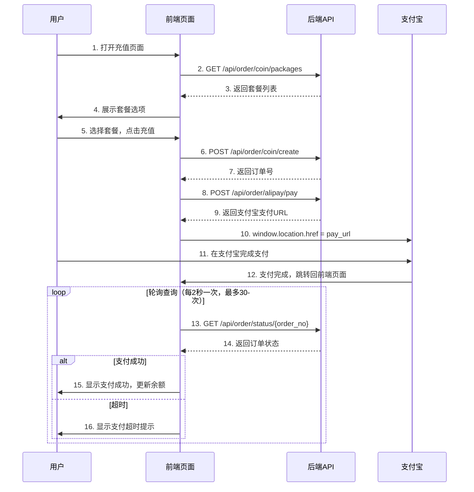

# 支付宝支付前端接入指南

## 📋 目录
- [快速开始](#快速开始)
- [完整流程图](#完整流程图)
- [接口调用顺序](#接口调用顺序)
- [API 接口详解](#api-接口详解)
- [前端代码示例](#前端代码示例)
- [错误处理](#错误处理)
- [测试建议](#测试建议)

---

## 快速开始

### 支付流程概览

```
用户选择套餐 → 创建订单 → 发起支付 → 跳转支付宝 → 完成支付 → 轮询查询 → 显示结果
```

### 需要调用的接口（共5个）

| 序号 | 接口 | 用途 | 是否需要登录 |
|------|------|------|-------------|
| 1 | `GET /api/order/coin/packages` | 获取金币套餐列表 | ❌ |
| 2 | `POST /api/order/coin/create` | 创建充值订单 | ✅ |
| 3 | `POST /api/order/alipay/pay` | 获取支付宝支付链接 | ✅ |
| 4 | `GET /api/order/status/{order_no}` | 轮询查询订单状态 | ✅ |
| 5 | `GET /api/order/{order_no}` | 查询订单详情（可选） | ✅ |

---

## 完整流程图



---

## 接口调用顺序

### 第 1 步：获取金币套餐列表

**场景**：用户打开充值页面时

```javascript
// 调用时机：页面加载时
fetch('https://qtoplay.com/api/order/coin/packages')
  .then(res => res.json())
  .then(data => {
    // 渲染套餐列表
    console.log(data.data); // 套餐数组
  });
```

### 第 2 步：创建充值订单

**场景**：用户选择套餐并点击"立即充值"按钮

```javascript
// 调用时机：用户点击充值按钮
const token = localStorage.getItem('token'); // 获取登录 token

fetch('https://qtoplay.com/api/order/coin/create', {
  method: 'POST',
  headers: {
    'Authorization': `Bearer ${token}`,
    'Content-Type': 'application/json'
  },
  body: JSON.stringify({
    item_id: 1,              // 用户选择的套餐ID
    pay_channel: 'alipay'    // 支付方式：alipay
  })
})
.then(res => res.json())
.then(data => {
  const orderNo = data.data.order_no;
  // 保存订单号，用于后续查询
  sessionStorage.setItem('current_order_no', orderNo);
});
```

### 第 3 步：获取支付宝支付链接

**场景**：订单创建成功后立即调用

```javascript
// 调用时机：创建订单成功后
const orderNo = sessionStorage.getItem('current_order_no');

fetch('https://qtoplay.com/api/order/alipay/pay', {
  method: 'POST',
  headers: {
    'Authorization': `Bearer ${token}`,
    'Content-Type': 'application/json'
  },
  body: JSON.stringify({
    order_no: orderNo
  })
})
.then(res => res.json())
.then(data => {
  if (data.success) {
    // 跳转到支付宝支付页面
    window.location.href = data.pay_url;
  }
});
```

### 第 4 步：支付完成后轮询查询订单状态

**场景**：支付宝跳转回来后（回调页面）

```javascript
// 调用时机：支付宝支付完成，跳转回前端页面
const orderNo = sessionStorage.getItem('current_order_no');

// 开始轮询查询订单状态
pollOrderStatus(orderNo);
```

---

## API 接口详解

### 1. 获取金币套餐列表

**接口地址**
```
GET https://qtoplay.com/api/order/coin/packages
```

**请求参数**
```
无需参数，无需登录
```

**响应示例**
```json
{
  "success": true,
  "data": [
    {
      "id": 1,
      "name": "100金币",
      "description": "适合新手尝鲜",
      "coin_amount": 100,
      "price": 1000,           // 单位：分（1000分 = 10元）
      "currency": "CNY"
    },
    {
      "id": 2,
      "name": "500金币",
      "description": "性价比之选",
      "coin_amount": 500,
      "price": 4500,           // 单位：分（4500分 = 45元）
      "currency": "CNY"
    }
  ],
  "total": 2,
  "message": "找到 2 个金币套餐"
}
```

**前端使用**
```javascript
// 显示价格时需要转换：分 -> 元
const priceInYuan = item.price / 100;
console.log(`¥${priceInYuan.toFixed(2)}`); // ¥10.00
```

---

### 2. 创建充值订单

**接口地址**
```
POST https://qtoplay.com/api/order/coin/create
```

**请求头**
```
Authorization: Bearer {token}
Content-Type: application/json
```

**请求参数**
```json
{
  "item_id": 1,              // 必填：套餐ID
  "pay_channel": "alipay"    // 必填：支付方式（alipay 或 mock）
}
```

**响应示例**
```json
{
  "success": true,
  "message": "订单创建成功",
  "data": {
    "order_no": "COIN202601211234567890abc",  // 订单号（重要！）
    "item_id": 1,
    "item_name": "100金币",
    "coin_amount": 100,
    "total_amount": 1000,      // 单位：分
    "status": "CREATED",       // 订单状态
    "pay_channel": "alipay",
    "created_at": "2026-01-21T12:34:56"
  }
}
```

**错误响应**
```json
{
  "success": false,
  "message": "无效的金币套餐",
  "detail": "..."
}
```

---

### 3. 获取支付宝支付链接

**接口地址**
```
POST https://qtoplay.com/api/order/alipay/pay
```

**请求头**
```
Authorization: Bearer {token}
Content-Type: application/json
```

**请求参数**
```json
{
  "order_no": "COIN202601211234567890abc"  // 必填：订单号
}
```

**响应示例**
```json
{
  "success": true,
  "message": "支付链接生成成功",
  "pay_url": "https://openapi.alipay.com/gateway.do?app_id=xxx&...",
  "order_no": "COIN202601211234567890abc"
}
```

**前端处理**
```javascript
// 方式1：直接跳转（推荐）
window.location.href = data.pay_url;

// 方式2：新窗口打开
window.open(data.pay_url, '_blank');
```

---

### 4. 查询订单状态（轮询）

**接口地址**
```
GET https://qtoplay.com/api/order/status/{order_no}
```

**请求头**
```
Authorization: Bearer {token}
```

**响应示例**
```json
{
  "success": true,
  "message": "查询成功",
  "order_no": "COIN202601211234567890abc",
  "status": "COMPLETED",     // 订单状态
  "is_paid": true            // 是否已支付
}
```

**订单状态说明**
| 状态 | 说明 | 前端处理 |
|------|------|---------|
| `CREATED` | 已创建，待支付 | 继续轮询 |
| `PAID` | 已支付，处理中 | 继续轮询 |
| `COMPLETED` | 已完成 | 停止轮询，显示成功 |
| `CANCELLED` | 已取消 | 停止轮询，显示失败 |

---

### 5. 查询订单详情（可选）

**接口地址**
```
GET https://qtoplay.com/api/order/{order_no}
```

**请求头**
```
Authorization: Bearer {token}
```

**响应示例**
```json
{
  "success": true,
  "message": "获取订单成功",
  "data": {
    "order_no": "COIN202601211234567890abc",
    "item_id": 1,
    "item_name": "100金币",
    "coin_amount": 100,
    "total_amount": 1000,
    "status": "COMPLETED",
    "pay_channel": "alipay",
    "created_at": "2026-01-21T12:34:56"
  }
}
```

---

## 前端代码示例

### 完整流程封装（Vue 3 示例）

```vue
<template>
  <div class="recharge-page">
    <h1>金币充值</h1>
    
    <!-- 套餐列表 -->
    <div class="package-list">
      <div 
        v-for="pkg in packages" 
        :key="pkg.id"
        class="package-item"
        :class="{ selected: selectedPackage?.id === pkg.id }"
        @click="selectPackage(pkg)"
      >
        <h3>{{ pkg.name }}</h3>
        <p>{{ pkg.description }}</p>
        <div class="price">¥{{ (pkg.price / 100).toFixed(2) }}</div>
        <div class="coins">{{ pkg.coin_amount }} 金币</div>
      </div>
    </div>
    
    <!-- 充值按钮 -->
    <button 
      @click="handleRecharge" 
      :disabled="!selectedPackage || loading"
      class="recharge-btn"
    >
      {{ loading ? '处理中...' : '立即充值' }}
    </button>
    
    <!-- 支付结果弹窗 -->
    <div v-if="showResult" class="result-modal">
      <div class="modal-content">
        <h2>{{ paymentResult.success ? '支付成功！' : '支付失败' }}</h2>
        <p>{{ paymentResult.message }}</p>
        <button @click="closeResult">确定</button>
      </div>
    </div>
  </div>
</template>

<script setup>
import { ref, onMounted } from 'vue';

const API_BASE_URL = 'https://qtoplay.com';
const packages = ref([]);
const selectedPackage = ref(null);
const loading = ref(false);
const showResult = ref(false);
const paymentResult = ref({ success: false, message: '' });

// 获取 token
const getToken = () => {
  return localStorage.getItem('token');
};

// 1. 获取套餐列表
const fetchPackages = async () => {
  try {
    const response = await fetch(`${API_BASE_URL}/api/order/coin/packages`);
    const data = await response.json();
    
    if (data.success) {
      packages.value = data.data;
    }
  } catch (error) {
    console.error('获取套餐列表失败:', error);
    alert('获取套餐列表失败，请刷新页面重试');
  }
};

// 选择套餐
const selectPackage = (pkg) => {
  selectedPackage.value = pkg;
};

// 2. 创建订单
const createOrder = async (itemId) => {
  const response = await fetch(`${API_BASE_URL}/api/order/coin/create`, {
    method: 'POST',
    headers: {
      'Authorization': `Bearer ${getToken()}`,
      'Content-Type': 'application/json'
    },
    body: JSON.stringify({
      item_id: itemId,
      pay_channel: 'alipay'
    })
  });
  
  const data = await response.json();
  
  if (!data.success) {
    throw new Error(data.message || '创建订单失败');
  }
  
  return data.data.order_no;
};

// 3. 获取支付链接
const getPaymentUrl = async (orderNo) => {
  const response = await fetch(`${API_BASE_URL}/api/order/alipay/pay`, {
    method: 'POST',
    headers: {
      'Authorization': `Bearer ${getToken()}`,
      'Content-Type': 'application/json'
    },
    body: JSON.stringify({
      order_no: orderNo
    })
  });
  
  const data = await response.json();
  
  if (!data.success) {
    throw new Error(data.message || '获取支付链接失败');
  }
  
  return data.pay_url;
};

// 4. 轮询查询订单状态
const pollOrderStatus = async (orderNo, maxAttempts = 30) => {
  for (let i = 0; i < maxAttempts; i++) {
    try {
      const response = await fetch(
        `${API_BASE_URL}/api/order/status/${orderNo}`,
        {
          headers: {
            'Authorization': `Bearer ${getToken()}`
          }
        }
      );
      
      const data = await response.json();
      
      if (data.is_paid) {
        // 支付成功
        return { success: true, message: '支付成功！金币已到账' };
      }
      
      if (data.status === 'CANCELLED') {
        // 订单已取消
        return { success: false, message: '订单已取消' };
      }
      
      // 等待 2 秒后继续查询
      await new Promise(resolve => setTimeout(resolve, 2000));
      
    } catch (error) {
      console.error('查询订单状态失败:', error);
    }
  }
  
  // 超时
  return { success: false, message: '支付超时，请稍后在订单列表中查看' };
};

// 主流程：充值
const handleRecharge = async () => {
  if (!selectedPackage.value) {
    alert('请选择充值套餐');
    return;
  }
  
  loading.value = true;
  
  try {
    // Step 1: 创建订单
    const orderNo = await createOrder(selectedPackage.value.id);
    console.log('订单创建成功:', orderNo);
    
    // 保存订单号
    sessionStorage.setItem('current_order_no', orderNo);
    
    // Step 2: 获取支付链接
    const payUrl = await getPaymentUrl(orderNo);
    console.log('支付链接获取成功');
    
    // Step 3: 跳转到支付宝
    window.location.href = payUrl;
    
  } catch (error) {
    loading.value = false;
    alert(error.message || '充值失败，请重试');
  }
};

// 支付回调页面：查询支付结果
const checkPaymentResult = async () => {
  const orderNo = sessionStorage.getItem('current_order_no');
  
  if (!orderNo) {
    return;
  }
  
  loading.value = true;
  
  try {
    const result = await pollOrderStatus(orderNo);
    paymentResult.value = result;
    showResult.value = true;
    
    // 清除订单号
    sessionStorage.removeItem('current_order_no');
    
    if (result.success) {
      // 刷新用户余额
      // await refreshUserBalance();
    }
  } catch (error) {
    paymentResult.value = {
      success: false,
      message: '查询支付结果失败'
    };
    showResult.value = true;
  } finally {
    loading.value = false;
  }
};

// 关闭结果弹窗
const closeResult = () => {
  showResult.value = false;
  if (paymentResult.value.success) {
    // 跳转到首页或刷新页面
    window.location.href = '/';
  }
};

// 页面加载时
onMounted(() => {
  // 获取套餐列表
  fetchPackages();
  
  // 如果 URL 参数表示这是支付回调页面，则查询支付结果
  const urlParams = new URLSearchParams(window.location.search);
  if (urlParams.get('from') === 'alipay') {
    checkPaymentResult();
  }
});
</script>

<style scoped>
/* 样式省略 */
</style>
```

---

### React 示例

```jsx
import React, { useState, useEffect } from 'react';

const API_BASE_URL = 'https://qtoplay.com';

const RechargePage = () => {
  const [packages, setPackages] = useState([]);
  const [selectedPackage, setSelectedPackage] = useState(null);
  const [loading, setLoading] = useState(false);

  // 获取 token
  const getToken = () => localStorage.getItem('token');

  // 获取套餐列表
  useEffect(() => {
    fetch(`${API_BASE_URL}/api/order/coin/packages`)
      .then(res => res.json())
      .then(data => {
        if (data.success) {
          setPackages(data.data);
        }
      })
      .catch(error => {
        console.error('获取套餐列表失败:', error);
      });
  }, []);

  // 创建订单
  const createOrder = async (itemId) => {
    const response = await fetch(`${API_BASE_URL}/api/order/coin/create`, {
      method: 'POST',
      headers: {
        'Authorization': `Bearer ${getToken()}`,
        'Content-Type': 'application/json'
      },
      body: JSON.stringify({
        item_id: itemId,
        pay_channel: 'alipay'
      })
    });
    
    const data = await response.json();
    if (!data.success) throw new Error(data.message);
    return data.data.order_no;
  };

  // 获取支付链接
  const getPaymentUrl = async (orderNo) => {
    const response = await fetch(`${API_BASE_URL}/api/order/alipay/pay`, {
      method: 'POST',
      headers: {
        'Authorization': `Bearer ${getToken()}`,
        'Content-Type': 'application/json'
      },
      body: JSON.stringify({ order_no: orderNo })
    });
    
    const data = await response.json();
    if (!data.success) throw new Error(data.message);
    return data.pay_url;
  };

  // 充值处理
  const handleRecharge = async () => {
    if (!selectedPackage) {
      alert('请选择充值套餐');
      return;
    }
    
    setLoading(true);
    
    try {
      const orderNo = await createOrder(selectedPackage.id);
      sessionStorage.setItem('current_order_no', orderNo);
      
      const payUrl = await getPaymentUrl(orderNo);
      window.location.href = payUrl;
    } catch (error) {
      setLoading(false);
      alert(error.message);
    }
  };

  return (
    <div className="recharge-page">
      <h1>金币充值</h1>
      
      <div className="package-list">
        {packages.map(pkg => (
          <div
            key={pkg.id}
            className={`package-item ${selectedPackage?.id === pkg.id ? 'selected' : ''}`}
            onClick={() => setSelectedPackage(pkg)}
          >
            <h3>{pkg.name}</h3>
            <p>{pkg.description}</p>
            <div className="price">¥{(pkg.price / 100).toFixed(2)}</div>
            <div className="coins">{pkg.coin_amount} 金币</div>
          </div>
        ))}
      </div>
      
      <button
        onClick={handleRecharge}
        disabled={!selectedPackage || loading}
        className="recharge-btn"
      >
        {loading ? '处理中...' : '立即充值'}
      </button>
    </div>
  );
};

export default RechargePage;
```

---

### 原生 JavaScript 示例

```javascript
// utils/alipay.js

const API_BASE_URL = 'https://qtoplay.com';

// 获取 token
function getToken() {
  return localStorage.getItem('token');
}

// 1. 获取套餐列表
async function fetchPackages() {
  const response = await fetch(`${API_BASE_URL}/api/order/coin/packages`);
  const data = await response.json();
  return data.data;
}

// 2. 创建订单
async function createOrder(itemId, payChannel = 'alipay') {
  const response = await fetch(`${API_BASE_URL}/api/order/coin/create`, {
    method: 'POST',
    headers: {
      'Authorization': `Bearer ${getToken()}`,
      'Content-Type': 'application/json'
    },
    body: JSON.stringify({
      item_id: itemId,
      pay_channel: payChannel
    })
  });
  
  const data = await response.json();
  
  if (!data.success) {
    throw new Error(data.message);
  }
  
  return data.data.order_no;
}

// 3. 获取支付链接
async function getPaymentUrl(orderNo) {
  const response = await fetch(`${API_BASE_URL}/api/order/alipay/pay`, {
    method: 'POST',
    headers: {
      'Authorization': `Bearer ${getToken()}`,
      'Content-Type': 'application/json'
    },
    body: JSON.stringify({
      order_no: orderNo
    })
  });
  
  const data = await response.json();
  
  if (!data.success) {
    throw new Error(data.message);
  }
  
  return data.pay_url;
}

// 4. 查询订单状态
async function checkOrderStatus(orderNo) {
  const response = await fetch(
    `${API_BASE_URL}/api/order/status/${orderNo}`,
    {
      headers: {
        'Authorization': `Bearer ${getToken()}`
      }
    }
  );
  
  const data = await response.json();
  return data;
}

// 5. 轮询查询订单状态
async function pollOrderStatus(orderNo, maxAttempts = 30, interval = 2000) {
  for (let i = 0; i < maxAttempts; i++) {
    try {
      const result = await checkOrderStatus(orderNo);
      
      if (result.is_paid) {
        return { success: true, message: '支付成功！', data: result };
      }
      
      if (result.status === 'CANCELLED') {
        return { success: false, message: '订单已取消', data: result };
      }
      
      // 等待后继续查询
      await new Promise(resolve => setTimeout(resolve, interval));
      
    } catch (error) {
      console.error('查询订单状态失败:', error);
    }
  }
  
  return { success: false, message: '支付超时' };
}

// 主流程：充值
async function startRecharge(packageId) {
  try {
    // Step 1: 创建订单
    console.log('正在创建订单...');
    const orderNo = await createOrder(packageId);
    console.log('订单创建成功:', orderNo);
    
    // 保存订单号
    sessionStorage.setItem('current_order_no', orderNo);
    
    // Step 2: 获取支付链接
    console.log('正在获取支付链接...');
    const payUrl = await getPaymentUrl(orderNo);
    console.log('支付链接获取成功');
    
    // Step 3: 跳转到支付宝
    window.location.href = payUrl;
    
  } catch (error) {
    console.error('充值失败:', error);
    alert(error.message);
  }
}

// 检查支付结果（用于回调页面）
async function checkPaymentResult() {
  const orderNo = sessionStorage.getItem('current_order_no');
  
  if (!orderNo) {
    console.log('没有待查询的订单');
    return;
  }
  
  console.log('正在查询支付结果...');
  
  const result = await pollOrderStatus(orderNo);
  
  // 清除订单号
  sessionStorage.removeItem('current_order_no');
  
  if (result.success) {
    alert('支付成功！金币已到账');
    // 刷新页面或跳转
    window.location.href = '/';
  } else {
    alert(result.message);
  }
}

// 导出
export {
  fetchPackages,
  createOrder,
  getPaymentUrl,
  checkOrderStatus,
  pollOrderStatus,
  startRecharge,
  checkPaymentResult
};
```

---

## 错误处理

### 常见错误及处理

```javascript
// 统一错误处理函数
async function handleApiCall(apiFunc) {
  try {
    return await apiFunc();
  } catch (error) {
    // 1. 网络错误
    if (!navigator.onLine) {
      throw new Error('网络连接失败，请检查网络');
    }
    
    // 2. 401 未授权
    if (error.status === 401) {
      alert('登录已过期，请重新登录');
      // 跳转到登录页
      window.location.href = '/login';
      return;
    }
    
    // 3. 其他错误
    throw error;
  }
}

// 使用示例
async function safeCreateOrder(itemId) {
  return handleApiCall(() => createOrder(itemId));
}
```

### 支付状态说明

| 场景 | 前端处理 |
|------|---------|
| 用户未完成支付就关闭页面 | 订单保持 CREATED 状态，15分钟后自动过期 |
| 支付宝支付成功但回调失败 | 继续轮询查询，后端会在异步回调时发货 |
| 用户支付后长时间未返回 | 下次进入页面时可查询未完成的订单 |
| 支付超时 | 提示用户稍后在"我的订单"中查看 |

---

## 测试建议

### 1. 本地测试（Mock 模式）

```javascript
// 使用 mock 支付通道测试流程
async function testRecharge() {
  const orderNo = await createOrder(1, 'mock'); // 使用 mock 模式
  
  // Mock 模式会自动完成支付
  await new Promise(resolve => setTimeout(resolve, 1000));
  
  // 查询订单状态
  const result = await checkOrderStatus(orderNo);
  console.log('订单状态:', result);
}
```

### 2. 沙箱环境测试

**测试账号**：从支付宝开放平台沙箱环境获取

**测试步骤**：
1. 配置后端使用沙箱环境
2. 前端正常调用接口
3. 使用沙箱账号完成支付
4. 验证金币是否到账

### 3. 生产环境测试

**注意事项**：
- 使用小额套餐测试（如1元套餐）
- 测试完整流程：创建订单 → 支付 → 回调 → 金币到账
- 验证订单列表是否正确显示

---

## 页面建议

### 必需页面

1. **充值页面** (`/recharge`)
   - 展示套餐列表
   - 选择套餐并发起支付

2. **支付回调页面** (`/payment-callback`)
   - 支付宝支付完成后跳转到此页面
   - 轮询查询订单状态
   - 显示支付结果

3. **订单列表页** (`/orders`)（可选）
   - 显示用户的充值记录
   - 可查询待支付订单

### 回调页面配置

**后端配置**：
```ini
# config_alipay.ini
return_url = https://qtoplay.com/payment-callback?from=alipay
```

**前端路由**：
```javascript
// 路由配置
{
  path: '/payment-callback',
  component: PaymentCallback,
  meta: { requiresAuth: true }
}
```

**回调页面逻辑**：
```javascript
// PaymentCallback.vue
onMounted(() => {
  const urlParams = new URLSearchParams(window.location.search);
  
  if (urlParams.get('from') === 'alipay') {
    // 查询订单状态
    checkPaymentResult();
  }
});
```

---

## 安全注意事项

1. **Token 管理**
   - Token 存储在 localStorage
   - 每次请求需要携带 Authorization 头
   - Token 过期时跳转到登录页

2. **订单号保护**
   - 订单号存储在 sessionStorage（临时）
   - 支付完成后立即清除

3. **HTTPS**
   - 生产环境必须使用 HTTPS
   - 支付回调地址必须是 HTTPS

4. **金额显示**
   - 后端返回金额单位是"分"
   - 前端显示时转换为"元"：`price / 100`

---

## 总结

### 核心流程（5步）

1. **获取套餐** → `GET /api/order/coin/packages`
2. **创建订单** → `POST /api/order/coin/create`
3. **获取支付链接** → `POST /api/order/alipay/pay`
4. **跳转支付宝** → `window.location.href = pay_url`
5. **轮询查询** → `GET /api/order/status/{order_no}`

### 关键点

- ✅ 订单号需要保存（sessionStorage）
- ✅ 支付后轮询查询状态（每2秒，最多30次）
- ✅ 价格单位转换（分 → 元）
- ✅ Token 认证
- ✅ 错误处理

### 示例代码位置

- Vue 3 完整示例：见上文"前端代码示例"
- React 示例：见上文"React 示例"
- 原生 JS 示例：见上文"原生 JavaScript 示例"

---

## 相关文档

- 后端接入文档：[ALIPAY_INTEGRATION_GUIDE.md](./ALIPAY_INTEGRATION_GUIDE.md)
- 快速配置指南：[ALIPAY_CERT_QUICK_START.md](../ALIPAY_CERT_QUICK_START.md)
