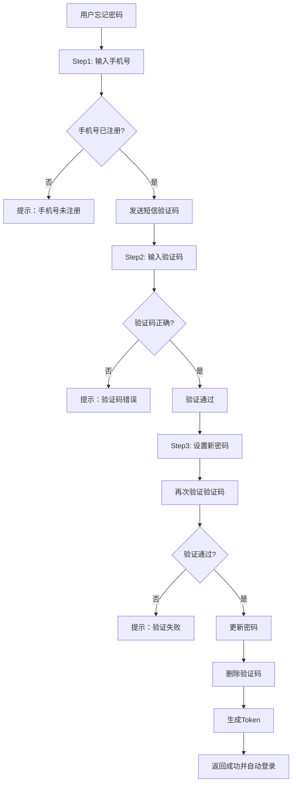

# 找回密码 API 文档

## 📋 概述

本文档描述了基于手机号的密码找回功能的API接口。用户通过手机号+短信验证码的方式重置密码。

**功能特点：**
- ✅ 三步式密码找回流程
- ✅ 短信验证码验证
- ✅ 自动登录（重置成功后）
- ✅ 防刷机制（IP限制、手机号频率限制、冷却时间）
- ✅ 安全验证（Step3 再次验证验证码）

---

## 🔄 完整流程



---

## 📡 API 接口

### **Step 1: 验证手机号并发送验证码**

验证手机号是否已注册，并发送短信验证码。

**接口信息：**
- **URL**: `POST /api/auth/forgot-password/step1`
- **认证**: 无需认证
- **限流**: IP每天10次，手机号每天3次，60秒冷却

**请求参数：**

```json
{
  "phone_number": "15810016095"
}
```

| 参数 | 类型 | 必填 | 说明 |
|------|------|------|------|
| phone_number | string | 是 | 中国大陆手机号（11位） |

**成功响应（200）：**

```json
{
  "success": true,
  "message": "验证码发送成功",
  "data": {
    "phone_number": "15810016095",
    "user_id": 123,
    "expire_minutes": 5,
    "remaining_seconds": 60,
    "next_step": "verify_code"
  }
}
```

**失败响应：**

```json
// 手机号未注册（404）
{
  "detail": "该手机号未注册，请先注册账号"
}

// 账号已禁用（403）
{
  "detail": "账号已被禁用，请联系管理员"
}

// 发送频率限制（400）
{
  "detail": "验证码发送过于频繁，请60秒后再试"
}

// IP限制（400）
{
  "detail": "今日发送次数已达上限（10次）"
}
```

**curl 示例：**

```bash
curl -X POST "http://127.0.0.1:9002/api/auth/forgot-password/step1" \
  -H "Content-Type: application/json" \
  -d '{
    "phone_number": "15810016095"
  }'
```

---

### **Step 2: 验证短信验证码**

验证用户输入的短信验证码是否正确。

**接口信息：**
- **URL**: `POST /api/auth/forgot-password/step2`
- **认证**: 无需认证
- **特点**: 验证成功后不删除验证码（留给 Step3 使用）

**请求参数：**

```json
{
  "phone_number": "15810016095",
  "code": "123456"
}
```

| 参数 | 类型 | 必填 | 说明 |
|------|------|------|------|
| phone_number | string | 是 | 手机号 |
| code | string | 是 | 6位数字验证码 |

**成功响应（200）：**

```json
{
  "success": true,
  "message": "验证成功，请设置新密码",
  "data": {
    "phone_number": "15810016095",
    "user_id": 123,
    "verified": true,
    "next_step": "set_new_password"
  }
}
```

**失败响应：**

```json
// 用户不存在（404）
{
  "detail": "用户不存在"
}

// 验证码不存在或已过期（400）
{
  "detail": "验证码不存在或已过期，请重新获取"
}

// 验证码错误（400）
{
  "detail": "验证码错误"
}
```

**curl 示例：**

```bash
curl -X POST "http://127.0.0.1:9002/api/auth/forgot-password/step2" \
  -H "Content-Type: application/json" \
  -d '{
    "phone_number": "15810016095",
    "code": "123456"
  }'
```

---

### **Step 3: 设置新密码**

设置新密码并自动登录。

**接口信息：**
- **URL**: `POST /api/auth/forgot-password/step3`
- **认证**: 无需认证
- **特点**: 
  - 再次验证验证码（确保安全）
  - 更新密码后删除验证码
  - 自动生成Token（自动登录）

**请求参数：**

```json
{
  "phone_number": "15810016095",
  "code": "123456",
  "new_password": "new_password_123456"
}
```

| 参数 | 类型 | 必填 | 说明 |
|------|------|------|------|
| phone_number | string | 是 | 手机号 |
| code | string | 是 | 6位数字验证码 |
| new_password | string | 是 | 新密码（至少6位） |

**成功响应（200）：**

```json
{
  "success": true,
  "message": "密码重置成功，已自动登录",
  "data": {
    "access_token": "eyJhbGciOiJIUzI1NiIsInR5cCI6IkpXVCJ9...",
    "token_type": "bearer",
    "user": {
      "id": 123,
      "email": "15810016095@sms.local",
      "phone": "15810016095",
      "is_active": true,
      "is_superuser": false,
      "created_at": "2026-01-13T10:30:00",
      "updated_at": "2026-01-13T15:45:00"
    },
    "phone_number": "15810016095",
    "password_reset": true
  }
}
```

**失败响应：**

```json
// 验证码验证失败（400）
{
  "detail": "验证码不存在或已过期"
}

// 用户不存在（404）
{
  "detail": "用户不存在"
}

// 密码更新失败（500）
{
  "detail": "密码更新失败，请稍后重试"
}

// 密码格式错误（422）
{
  "detail": [
    {
      "loc": ["body", "new_password"],
      "msg": "密码长度至少为6位",
      "type": "value_error"
    }
  ]
}
```

**curl 示例：**

```bash
curl -X POST "http://127.0.0.1:9002/api/auth/forgot-password/step3" \
  -H "Content-Type: application/json" \
  -d '{
    "phone_number": "15810016095",
    "code": "123456",
    "new_password": "new_password_123456"
  }'
```

---

## 🔒 安全特性

### **1. 防刷机制**

| 限制类型 | 限制规则 | 说明 |
|---------|---------|------|
| IP限制 | 每天10次 | 防止单个IP恶意发送 |
| 手机号限制 | 每天3次 | 防止单个手机号被刷 |
| 冷却时间 | 60秒 | 防止短时间内重复发送 |
| 验证码过期 | 5分钟 | 验证码自动过期 |

### **2. 验证码安全**

- ✅ 6位纯数字
- ✅ 5分钟自动过期
- ✅ 验证成功后自动删除（防止重复使用）
- ✅ Step3 再次验证（双重验证）
- ✅ 存储在内存中（重启后清空）

### **3. 账号验证**

- ✅ 必须是已注册的手机号
- ✅ 账号必须处于激活状态
- ✅ 支持两种查询方式：
  - 通过 `phone` 字段查询
  - 通过临时邮箱（`{phone}@sms.local`）查询

### **4. 密码安全**

- ✅ 新密码至少6位
- ✅ 使用 bcrypt 加密存储
- ✅ 更新后旧密码立即失效
- ✅ 自动生成Token（无需重新登录）

---

## 📱 使用示例

### **Python 示例**

```python
import requests

BASE_URL = "http://127.0.0.1:9002"
PHONE = "15810016095"

# Step 1: 发送验证码
response = requests.post(
    f"{BASE_URL}/api/auth/forgot-password/step1",
    json={"phone_number": PHONE}
)
print(response.json())

# Step 2: 验证验证码
code = input("请输入验证码: ")
response = requests.post(
    f"{BASE_URL}/api/auth/forgot-password/step2",
    json={"phone_number": PHONE, "code": code}
)
print(response.json())

# Step 3: 设置新密码
new_password = "new_password_123"
response = requests.post(
    f"{BASE_URL}/api/auth/forgot-password/step3",
    json={
        "phone_number": PHONE,
        "code": code,
        "new_password": new_password
    }
)
result = response.json()
print(result)

# 获取Token
if result['success']:
    token = result['data']['access_token']
    print(f"Token: {token}")
```

### **JavaScript 示例**

```javascript
const BASE_URL = 'http://127.0.0.1:9002';
const PHONE = '15810016095';

// Step 1: 发送验证码
async function sendCode() {
  const response = await fetch(`${BASE_URL}/api/auth/forgot-password/step1`, {
    method: 'POST',
    headers: { 'Content-Type': 'application/json' },
    body: JSON.stringify({ phone_number: PHONE })
  });
  return await response.json();
}

// Step 2: 验证验证码
async function verifyCode(code) {
  const response = await fetch(`${BASE_URL}/api/auth/forgot-password/step2`, {
    method: 'POST',
    headers: { 'Content-Type': 'application/json' },
    body: JSON.stringify({ phone_number: PHONE, code: code })
  });
  return await response.json();
}

// Step 3: 设置新密码
async function resetPassword(code, newPassword) {
  const response = await fetch(`${BASE_URL}/api/auth/forgot-password/step3`, {
    method: 'POST',
    headers: { 'Content-Type': 'application/json' },
    body: JSON.stringify({
      phone_number: PHONE,
      code: code,
      new_password: newPassword
    })
  });
  const result = await response.json();
  if (result.success) {
    const token = result.data.access_token;
    localStorage.setItem('token', token);
  }
  return result;
}
```

---

## 🧪 测试方法

### **1. 使用测试脚本**

```bash
# 运行完整测试
python src/user/test/test_forgot_password.py
```

### **2. 手动测试步骤**

```bash
# 1. 发送验证码
curl -X POST "http://127.0.0.1:9002/api/auth/forgot-password/step1" \
  -H "Content-Type: application/json" \
  -d '{"phone_number": "15810016095"}'

# 2. 验证验证码（替换为实际验证码）
curl -X POST "http://127.0.0.1:9002/api/auth/forgot-password/step2" \
  -H "Content-Type: application/json" \
  -d '{"phone_number": "15810016095", "code": "123456"}'

# 3. 设置新密码
curl -X POST "http://127.0.0.1:9002/api/auth/forgot-password/step3" \
  -H "Content-Type: application/json" \
  -d '{
    "phone_number": "15810016095",
    "code": "123456",
    "new_password": "new_password_123"
  }'

# 4. 验证新密码登录
curl -X POST "http://127.0.0.1:9002/api/auth/login" \
  -H "Content-Type: application/json" \
  -d '{
    "email": "15810016095@sms.local",
    "password": "new_password_123"
  }'
```

---

## ❓ 常见问题

### **Q1: 提示"该手机号未注册"怎么办？**

**A:** 该手机号必须先通过短信注册或邮箱注册。只有已注册的用户才能找回密码。

```bash
# 先注册
curl -X POST "http://127.0.0.1:9002/api/auth/sms/register" \
  -H "Content-Type: application/json" \
  -d '{"phone_number": "15810016095", "code": "123456"}'
```

---

### **Q2: 验证码一直提示"已过期"？**

**A:** 验证码有效期为5分钟，请在收到验证码后尽快使用。如果过期，请重新发送。

---

### **Q3: 为什么Step2验证成功后，Step3又提示验证码错误？**

**A:** 可能的原因：
1. 验证码已过期（5分钟）
2. 在Step2和Step3之间重新发送了验证码
3. 输入的验证码不正确

**解决方法：** 重新从Step1开始操作。

---

### **Q4: 同时支持邮箱找回密码吗？**

**A:** 当前只支持手机号找回密码。如果需要邮箱找回密码，需要另外实现邮件发送功能。

---

### **Q5: 重置密码后，原来的Token还能用吗？**

**A:** 可以使用。密码重置不会使现有Token失效。如果需要强制失效，需要实现Token黑名单机制。

---

### **Q6: 可以跳过Step2直接到Step3吗？**

**A:** 不可以。虽然Step3会再次验证验证码，但Step2提供了用户体验优化，可以提前告知用户验证码是否正确。

---

### **Q7: 为什么提示"今日发送次数已达上限"？**

**A:** 防刷机制限制：
- 每个手机号每天最多发送3次
- 每个IP每天最多发送10次
- 每次发送后60秒内不能重复发送

**解决方法：** 等待到第二天或联系管理员重置限制。

---

## 🔧 配置说明

### **短信服务配置**

在 `fastapi_auth_server.py` 中配置：

```python
sms_service = SmsVerificationService(
    sign_name='速通互联验证码',     # 短信签名
    template_code='100001',         # 短信模板编码
    expire_minutes=5,               # 验证码有效期（分钟）
    max_send_per_phone=3,           # 每个手机号每天最多发送次数
    max_send_per_ip=10              # 每个IP每天最多发送次数
)
```

### **修改配置**

```python
# 修改验证码有效期为10分钟
sms_service = SmsVerificationService(
    expire_minutes=10,
    # ...其他配置
)

# 修改手机号发送次数限制为5次
sms_service = SmsVerificationService(
    max_send_per_phone=5,
    # ...其他配置
)
```

---

## 📊 数据流转

```
用户输入手机号
    ↓
[Step1 API]
    ↓
检查数据库（users表）
    ↓
发送短信验证码（阿里云短信服务）
    ↓
验证码存储在内存（sms_service.verification_codes）
    ↓
用户输入验证码
    ↓
[Step2 API]
    ↓
验证验证码（内存查询）
    ↓
返回验证结果（不删除验证码）
    ↓
用户输入新密码
    ↓
[Step3 API]
    ↓
再次验证验证码
    ↓
更新数据库密码（users表）
    ↓
删除验证码（内存）
    ↓
生成JWT Token
    ↓
返回Token和用户信息
```

---

## 🎯 总结

### **优势**

✅ 三步式流程，用户体验友好
✅ 双重验证（Step2 + Step3），安全性高
✅ 自动登录，减少用户操作
✅ 完善的防刷机制
✅ 详细的错误提示

### **限制**

⚠️ 只支持手机号找回（需要先绑定手机号）
⚠️ 验证码存储在内存（服务重启后丢失）
⚠️ 需要配置阿里云短信服务

### **后续优化建议**

1. 支持邮箱找回密码
2. 验证码持久化（Redis）
3. 增加图形验证码（防止机器刷）
4. 密码修改后强制Token失效
5. 增加密码强度校验
6. 记录密码修改日志

---

## 📚 相关文档

- [短信验证码API文档](./SMS_AUTH_API.md)
- [用户认证API文档](./README.md)
- [手机号迁移指南](./PHONE_FIELD_MIGRATION_GUIDE.md)

---

**最后更新时间：** 2026-01-13
