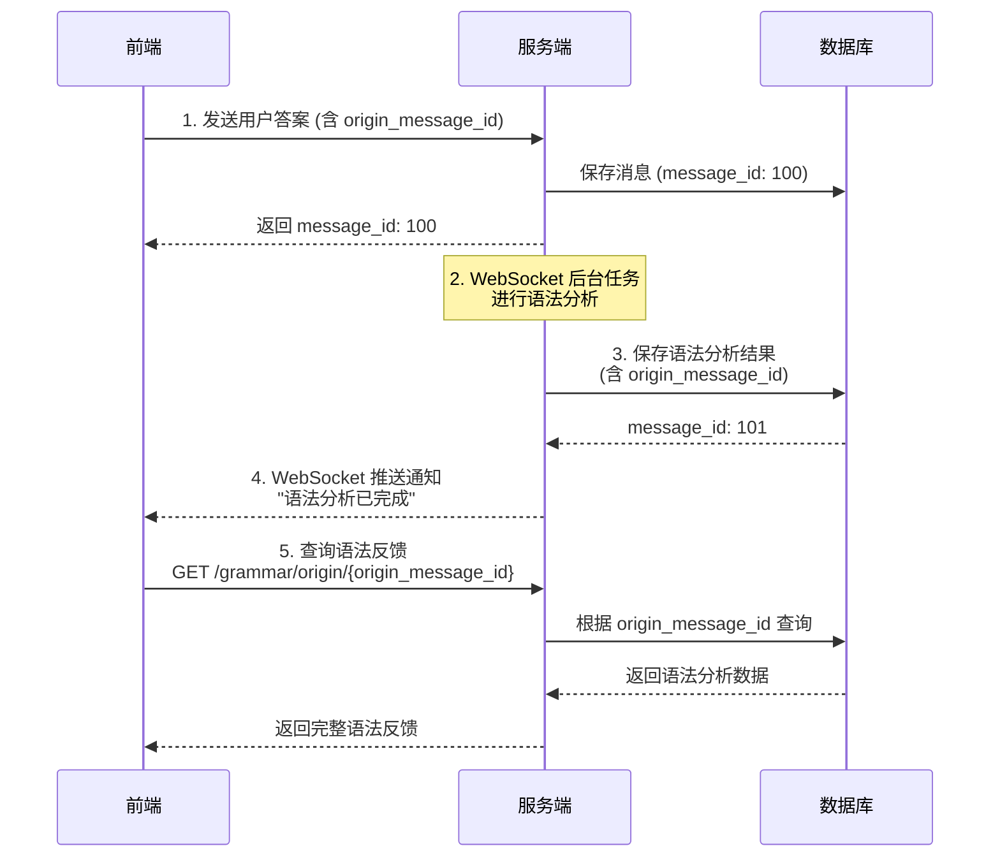

# 语法分析 API - 前端开发快速参考

> **适用对象**: 前端开发人员  
> **更新日期**: 2026-02-03  
> **基础路径**: `http://127.0.0.1:9002`

---

## 📋 接口清单

| 接口 | 方法 | 端点 | 说明 |
|------|------|------|------|
| 创建语法分析消息 | POST | `/api/spoken/conversations/{conversation_id}/messages/grammar` | 保存AI语法分析结果 |
| 根据消息ID获取 | GET | `/api/spoken/messages/grammar/{message_id}` | 查询语法分析详情 |
| 根据原始消息ID获取 | GET | `/api/spoken/messages/grammar/origin/{origin_message_id}` | 通过客户端消息ID查询 |
| 删除语法分析消息 | DELETE | `/api/spoken/messages/grammar/{message_id}` | 删除语法反馈 |

---

## 🔐 认证方式

所有接口需要在请求头中携带 Token：

```http
Authorization: Bearer {your_token}
```

---

## 📡 接口详情

### 1️⃣ 创建语法分析消息

**场景**: 后台 WebSocket 处理完用户答案后，保存语法分析结果到数据库

#### 请求

```http
POST /api/spoken/conversations/{conversation_id}/messages/grammar
Content-Type: application/json
Authorization: Bearer {token}
```

**路径参数**:
- `conversation_id` (必填): 会话ID

**请求体参数**:

| 字段 | 类型 | 必填 | 说明 | 示例 |
|------|------|------|------|------|
| origin_message_id | string | 否 | 客户端原始消息ID，用于关联用户答案 | `"client_msg_12345"` |
| exam_level | string | **是** | 考试等级 | `"KET"` / `"PET"` / `"FCE"` |
| errors_json | string | 否 | 错误列表JSON字符串 | `"[{\"error_type\":\"grammar\",...}]"` |
| error_count | int | 否 | 错误总数（默认0） | `2` |
| improved_version | string | 否 | 改进后的句子 | `"I went to the store."` |
| suggestions_json | string | 否 | 学习建议JSON字符串（3条） | `"[\"建议1\",\"建议2\",\"建议3\"]"` |
| overall_quality | string | 否 | 整体质量 | `"excellent"` / `"good"` / `"fair"` / `"poor"` |
| assessment_json | string | 否 | 分级评估JSON字符串 | `"{\"grammar\":6.5,\"vocabulary\":7.0}"` |
| relevance_score | float | 否 | 相关性分数（0.00-1.00） | `0.95` |
| relevance_level | string | 否 | 相关性等级 | `"on_topic"` / `"partially_on_topic"` / `"off_topic"` |
| relevance_reason | string | 否 | 相关性判断理由 | `"回答与问题高度相关"` |
| raw_json | string | 否 | 完整原始JSON响应（备份） | `"{...}"` |
| round_num | int | 否 | 轮次号 | `1` |
| created_at | string | 否 | 创建时间（ISO 8601格式） | `"2026-02-02T10:30:00"` |

**JavaScript 请求示例**:

```javascript
const response = await fetch(`http://127.0.0.1:9002/api/spoken/conversations/${conversationId}/messages/grammar`, {
  method: 'POST',
  headers: {
    'Authorization': `Bearer ${token}`,
    'Content-Type': 'application/json'
  },
  body: JSON.stringify({
    origin_message_id: 'client_msg_12345',
    exam_level: 'FCE',
    errors_json: JSON.stringify([
      {
        error_type: 'grammar',
        original_text: 'I goed',
        corrected_text: 'I went',
        explanation: '动词 go 的过去式应该是 went',
        severity: 'critical',
        criterion: 'b2_criterion'
      }
    ]),
    error_count: 1,
    improved_version: 'I went to the store yesterday.',
    suggestions_json: JSON.stringify([
      '注意不规则动词的过去式变化',
      '多阅读英文原著',
      '培养语感'
    ]),
    overall_quality: 'good',
    assessment_json: JSON.stringify({
      grammar: 6.5,
      vocabulary: 7.0,
      coherence: 7.5,
      task_achievement: 7.0
    }),
    relevance_score: 0.95,
    relevance_level: 'on_topic',
    relevance_reason: '回答与问题高度相关',
    round_num: 1
  })
});

const data = await response.json();
```

#### 响应

**成功响应 (200)**:

```json
{
  "success": true,
  "message": "语法分析消息创建成功",
  "data": {
    "id": 123,
    "conversation_id": 45,
    "user_id": 1,
    "sender": "ai",
    "message_type": "text",
    "content": "I went to the store yesterday.",
    "round_num": 1,
    "timestamp": "2026-02-02T10:30:00",
    "origin_message_id": "client_msg_12345",
    "exam_level": "FCE",
    "error_count": 1,
    "improved_version": "I went to the store yesterday.",
    "overall_quality": "good",
    "relevance_score": 0.95,
    "relevance_level": "on_topic"
  },
  "error_code": null
}
```

**错误响应**:

```json
{
  "success": false,
  "message": "会话不存在",
  "data": null,
  "error_code": "CONVERSATION_NOT_FOUND"
}
```

---

### 2️⃣ 根据消息ID获取语法分析消息

**场景**: 根据消息ID查询语法分析详情

#### 请求

```http
GET /api/spoken/messages/grammar/{message_id}
Authorization: Bearer {token}
```

**路径参数**:
- `message_id` (必填): 消息ID

**JavaScript 请求示例**:

```javascript
const messageId = 123;
const response = await fetch(`http://127.0.0.1:9002/api/spoken/messages/grammar/${messageId}`, {
  method: 'GET',
  headers: {
    'Authorization': `Bearer ${token}`
  }
});

const data = await response.json();
console.log('语法分析详情:', data.data);
```

#### 响应

**成功响应 (200)**:

```json
{
  "success": true,
  "message": "获取语法分析消息成功",
  "data": {
    "id": 123,
    "conversation_id": 45,
    "user_id": 1,
    "origin_message_id": "client_msg_12345",
    "exam_level": "FCE",
    "errors_json": "[...]",
    "error_count": 2,
    "improved_version": "I went to the store yesterday.",
    "suggestions_json": "[...]",
    "overall_quality": "good",
    "assessment_json": "{...}",
    "relevance_score": 0.95,
    "relevance_level": "on_topic",
    "relevance_reason": "回答与问题高度相关",
    "timestamp": "2026-02-02T10:30:00"
  },
  "error_code": null
}
```

**错误响应**:

| HTTP状态码 | error_code | 说明 |
|-----------|------------|------|
| 404 | MESSAGE_NOT_FOUND | 消息不存在 |
| 403 | PERMISSION_DENIED | 无权访问此消息 |

---

### 3️⃣ 根据原始消息ID获取语法分析消息 ⭐

**场景**: 客户端通过自己生成的消息ID查询对应的语法反馈（**推荐使用**）

#### 请求

```http
GET /api/spoken/messages/grammar/origin/{origin_message_id}
Authorization: Bearer {token}
```

**路径参数**:
- `origin_message_id` (必填): 客户端原始消息ID

**JavaScript 请求示例**:

```javascript
const originMessageId = 'client_msg_12345'; // 客户端发送答案时生成的ID
const response = await fetch(
  `http://127.0.0.1:9002/api/spoken/messages/grammar/origin/${originMessageId}`,
  {
    method: 'GET',
    headers: {
      'Authorization': `Bearer ${token}`
    }
  }
);

const data = await response.json();
if (data.success) {
  // 解析 JSON 字段
  const errors = JSON.parse(data.data.errors_json || '[]');
  const suggestions = JSON.parse(data.data.suggestions_json || '[]');
  const assessment = JSON.parse(data.data.assessment_json || '{}');
  
  console.log('错误列表:', errors);
  console.log('学习建议:', suggestions);
  console.log('评估分数:', assessment);
}
```

#### 响应

与"根据消息ID获取"接口响应格式相同。

---

### 4️⃣ 删除语法分析消息

**场景**: 删除语法分析消息（会级联删除相关数据）

#### 请求

```http
DELETE /api/spoken/messages/grammar/{message_id}
Authorization: Bearer {token}
```

**路径参数**:
- `message_id` (必填): 消息ID

**JavaScript 请求示例**:

```javascript
const messageId = 123;
const response = await fetch(`http://127.0.0.1:9002/api/spoken/messages/grammar/${messageId}`, {
  method: 'DELETE',
  headers: {
    'Authorization': `Bearer ${token}`
  }
});

const data = await response.json();
if (data.success) {
  console.log('删除成功');
}
```

#### 响应

**成功响应 (200)**:

```json
{
  "success": true,
  "message": "语法分析消息删除成功",
  "data": {
    "message_id": 123
  },
  "error_code": null
}
```

**错误响应**:

| HTTP状态码 | error_code | 说明 |
|-----------|------------|------|
| 404 | MESSAGE_NOT_FOUND | 消息不存在 |
| 403 | PERMISSION_DENIED | 无权删除此消息 |
| 500 | DELETE_FAILED | 删除失败 |

---

## 🔄 完整交互流程



### 流程说明

1. **用户发送答案**: 前端生成唯一ID（如 UUID）作为 `origin_message_id`
2. **后台语法分析**: 服务端 WebSocket 异步处理
3. **保存分析结果**: 服务端调用创建接口，带上 `origin_message_id`
4. **前端轮询/推送**: 通过 `origin_message_id` 查询语法反馈

---

## 📦 JSON 字段格式

### errors_json 示例

```json
[
  {
    "error_type": "grammar",
    "original_text": "I goed",
    "corrected_text": "I went",
    "explanation": "动词 'go' 的过去式应该是 'went'",
    "severity": "critical",
    "criterion": "b2_criterion"
  },
  {
    "error_type": "spelling",
    "original_text": "recieve",
    "corrected_text": "receive",
    "explanation": "单词拼写错误",
    "severity": "minor",
    "criterion": "b2_criterion"
  }
]
```

### suggestions_json 示例

```json
[
  "注意不规则动词的过去式变化",
  "记住常见的拼写规则",
  "多阅读英文原著，培养语感"
]
```

### assessment_json 示例（FCE）

```json
{
  "grammar": 6.5,
  "vocabulary": 7.0,
  "coherence": 7.5,
  "task_achievement": 7.0
}
```

**注意**: 不同考试等级的评估字段不同：
- **KET (A2)**: `a2_grammar`, `a2_vocabulary`, `a2_coherence`, `a2_task_achievement`
- **PET (B1)**: `b1_grammar`, `b1_vocabulary`, `b1_coherence`, `b1_task_achievement`
- **FCE (B2)**: `grammar`, `vocabulary`, `coherence`, `task_achievement`

---

## ⚠️ 重要提示

### 1. JSON 字符串处理

前端发送数据时，需要将对象转换为 JSON 字符串：

```javascript
// ✅ 正确
body: JSON.stringify({
  errors_json: JSON.stringify(errorsArray),  // 注意：双重序列化
  suggestions_json: JSON.stringify(suggestionsArray)
})

// ❌ 错误
body: JSON.stringify({
  errors_json: errorsArray  // 错误：直接传对象
})
```

### 2. origin_message_id 的作用

- **建议客户端生成唯一ID**（如 UUID 或时间戳组合）
- 发送用户答案时携带此ID
- 后续可通过此ID快速查询对应的语法反馈
- 支持前端在不知道 `message_id` 的情况下查询结果

**生成示例**:

```javascript
const originMessageId = `msg_${Date.now()}_${Math.random().toString(36).substr(2, 9)}`;
```

### 3. 时间格式

`created_at` 字段使用 ISO 8601 格式：

```javascript
const now = new Date().toISOString(); // "2026-02-02T10:30:00.000Z"
```

### 4. 权限说明

- 普通用户只能操作自己的语法分析消息
- 超级管理员可以操作所有用户的消息

---

## 🚨 常见错误码

| 错误码 | HTTP状态码 | 说明 | 处理建议 |
|--------|-----------|------|---------|
| CONVERSATION_NOT_FOUND | 404 | 会话不存在 | 检查 conversation_id 是否正确 |
| MESSAGE_NOT_FOUND | 404 | 消息不存在 | 检查 message_id 是否正确 |
| PERMISSION_DENIED | 403 | 权限不足 | 检查 Token 是否有效 |
| CREATE_FAILED | 500 | 创建失败 | 检查请求参数格式 |
| DELETE_FAILED | 500 | 删除失败 | 联系后端排查 |

---

## 🧪 快速测试

### curl 测试命令

```bash
# 1. 创建语法分析消息
curl -X POST "http://127.0.0.1:9002/api/spoken/conversations/1/messages/grammar" \
  -H "Authorization: Bearer YOUR_TOKEN" \
  -H "Content-Type: application/json" \
  -d '{
    "origin_message_id": "test_msg_001",
    "exam_level": "FCE",
    "error_count": 0,
    "improved_version": "Perfect answer!",
    "overall_quality": "excellent",
    "round_num": 1
  }'

# 2. 根据消息ID获取
curl -X GET "http://127.0.0.1:9002/api/spoken/messages/grammar/123" \
  -H "Authorization: Bearer YOUR_TOKEN"

# 3. 根据原始消息ID获取
curl -X GET "http://127.0.0.1:9002/api/spoken/messages/grammar/origin/test_msg_001" \
  -H "Authorization: Bearer YOUR_TOKEN"

# 4. 删除语法分析消息
curl -X DELETE "http://127.0.0.1:9002/api/spoken/messages/grammar/123" \
  -H "Authorization: Bearer YOUR_TOKEN"
```

---

## 📚 相关文档

- [语法分析完整 API 文档](./GRAMMAR_MESSAGE_API.md)
- [语法分析输出规范](./GRAMMAR_ANALYSIS_OUTPUT_SPEC.md)
- [口语练习 API](./SPOKEN_PRACTICE_API.md)

---

**技术支持**: 如有问题，请联系后端开发团队
