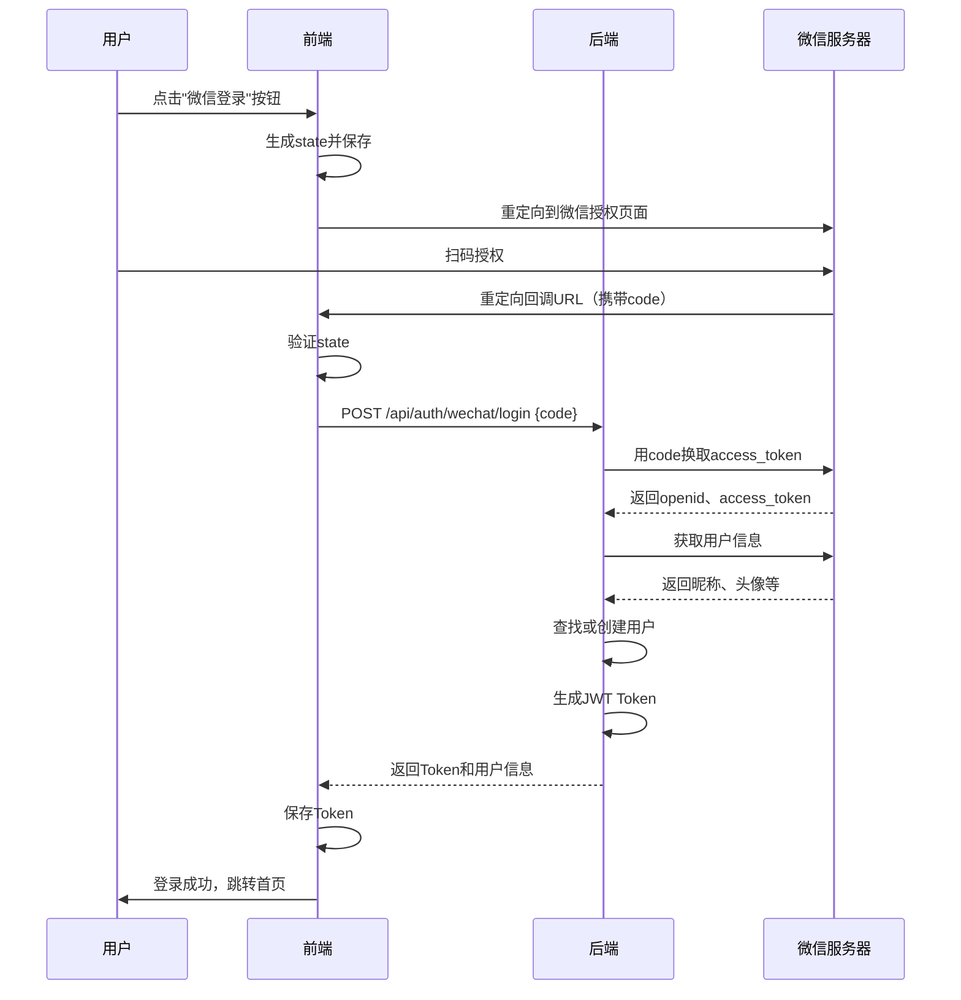

## 4. API接口说明

### 4.1 微信登录接口

**接口地址**：`POST /api/auth/wechat/login`

**请求参数**：

| 字段名 | 类型 | 必填 | 说明 |
|--------|------|------|------|
| code | string | ✅ | 微信授权码 |

**请求示例**：

```bash
curl -X POST "http://localhost:9002/api/auth/wechat/login" \
  -H "Content-Type: application/json" \
  -d '{
    "code": "021abc123def"
  }'
```

**响应参数**：

| 字段名 | 类型 | 说明 |
|--------|------|------|
| success | boolean | 请求是否成功 |
| message | string | 响应消息 |
| data.access_token | string | JWT访问令牌 |
| data.token_type | string | 令牌类型（bearer） |
| data.user | object | 用户信息对象 |
| data.login_method | string | 登录方式（wechat） |
| data.is_new_user | boolean | 是否新用户 |
| data.auto_registered | boolean | 是否自动注册（可选） |

**成功响应示例**：

```json
{
  "success": true,
  "message": "登录成功",
  "data": {
    "access_token": "eyJhbGciOiJIUzI1NiIsInR5cCI6IkpXVCJ9...",
    "token_type": "bearer",
    "user": {
      "id": 100,
      "email": "wx_o1234567890@wechat.local",
      "username": "张三",
      "wechat_openid": "o1234567890abcdef",
      "wechat_unionid": "u0987654321fedcba",
      "wechat_nickname": "张三",
      "wechat_avatar": "https://thirdwx.qlogo.cn/...",
      "login_type": "wechat",
      "is_active": true,
      "is_superuser": false,
      "created_at": "2026-01-24T10:30:00"
    },
    "login_method": "wechat",
    "is_new_user": false
  }
}
```

**首次登录（自动注册）响应**：

```json
{
  "success": true,
  "message": "登录成功（首次登录已自动注册）",
  "data": {
    "access_token": "eyJhbGciOiJIUzI1NiIsInR5cCI6IkpXVCJ9...",
    "token_type": "bearer",
    "user": { ... },
    "login_method": "wechat",
    "is_new_user": true,
    "auto_registered": true
  }
}
```

**错误响应**：

```json
{
  "detail": "微信登录失败: 微信API错误: errcode=40029, errmsg=invalid code"
}
```

---

## 5. 前端集成

### 5.1 网站应用集成（扫码登录）

#### 步骤1：引导用户授权

构造微信授权URL：

```javascript
const APPID = 'your_appid';
const REDIRECT_URI = encodeURIComponent('https://www.example.com/auth/callback');
const STATE = 'random_state_string';  // 防CSRF攻击

const authUrl = `https://open.weixin.qq.com/connect/qrconnect?appid=${APPID}&redirect_uri=${REDIRECT_URI}&response_type=code&scope=snsapi_login&state=${STATE}#wechat_redirect`;

// 跳转到微信授权页面
window.location.href = authUrl;
```

#### 步骤2：处理授权回调

用户扫码授权后，微信会重定向到你的回调URL，携带code参数：

```
https://www.example.com/auth/callback?code=021abc123def&state=random_state_string
```

获取code并调用后端接口：

```javascript
// auth/callback 页面
const urlParams = new URLSearchParams(window.location.search);
const code = urlParams.get('code');
const state = urlParams.get('state');

// 验证state防止CSRF攻击
if (state !== localStorage.getItem('wechat_login_state')) {
  alert('登录失败：状态验证失败');
  return;
}

// 调用后端接口
fetch('/api/auth/wechat/login', {
  method: 'POST',
  headers: {
    'Content-Type': 'application/json'
  },
  body: JSON.stringify({ code: code })
})
.then(response => response.json())
.then(data => {
  if (data.success) {
    // 保存token
    localStorage.setItem('access_token', data.data.access_token);
    localStorage.setItem('user_info', JSON.stringify(data.data.user));
    
    // 跳转到首页
    window.location.href = '/';
  } else {
    alert('登录失败：' + data.detail);
  }
})
.catch(error => {
  console.error('登录错误：', error);
  alert('登录失败，请重试');
});
```


### 5.3 React 集成示例

```jsx
import React, { useState } from 'react';
import axios from 'axios';

const WeChatLogin = () => {
  const [loading, setLoading] = useState(false);
  const APPID = 'your_wechat_appid';
  const REDIRECT_URI = encodeURIComponent(window.location.origin + '/auth/wechat/callback');
  
  const handleWeChatLogin = () => {
    const state = Math.random().toString(36).substring(2, 15);
    localStorage.setItem('wechat_login_state', state);
    
    const authUrl = `https://open.weixin.qq.com/connect/qrconnect?appid=${APPID}&redirect_uri=${REDIRECT_URI}&response_type=code&scope=snsapi_login&state=${state}#wechat_redirect`;
    
    window.location.href = authUrl;
  };
  
  return (
    <button onClick={handleWeChatLogin} disabled={loading}>
      
      微信登录
    </button>
  );
};

export default WeChatLogin;
```

---

## 6. 业务流程说明

### 6.1 完整登录流程



### 6.2 数据表关系

```
users 表
├── id (主键)
├── email (邮箱，微信用户格式：wx_{openid}@wechat.local)
├── username (用户名，微信用户取昵称)
├── wechat_openid (微信OpenID，唯一索引) ← 主要查询字段
├── wechat_unionid (微信UnionID)
├── wechat_nickname (微信昵称)
├── wechat_avatar (微信头像URL)
└── login_type ('wechat')
```

---

## 7. 常见问题

### Q1: 如何获取微信授权码(code)?

**A**: 前端需要重定向用户到微信授权页面，用户扫码授权后，微信会将code作为URL参数返回。

### Q2: code的有效期是多久?

**A**: 微信授权码(code)的有效期是5分钟，且只能使用一次。

### Q3: 微信用户如何设置密码?

**A**: 微信登录的用户可以通过 `/api/auth/set-password` 接口设置密码，设置后可以同时使用微信登录和密码登录。

### Q4: 如何区分微信用户和普通用户?

**A**: 通过 `login_type` 字段区分：
- `email`: 邮箱注册用户
- `phone`: 手机号注册用户
- `wechat`: 微信登录用户

### Q5: 如何处理微信昵称和头像更新?

**A**: 每次微信登录时，后端会自动更新用户的昵称和头像为最新信息。

### Q6: 微信登录失败常见原因

**错误码40029**：code无效或已使用
- 解决：确保每次登录使用新的code

**错误码40163**：code已被使用
- 解决：不要重复使用同一个code

**请求超时**：
- 解决：检查服务器网络，确保能访问微信API

---

## 8. 测试指南

### 8.1 本地测试

1. 配置内网穿透工具（如ngrok）：
```bash
ngrok http 9002
```

2. 将ngrok提供的域名配置到微信开放平台的授权回调域名

3. 访问测试页面进行登录测试

### 8.2 测试账号

在微信开放平台添加测试账号，测试账号可以正常授权登录。

---

## 9. 安全建议

1. **保护AppSecret**：
   - 不要将AppSecret提交到代码仓库
   - 使用环境变量或密钥管理服务

2. **验证state参数**：
   - 防止CSRF攻击
   - 每次授权生成新的随机state

3. **HTTPS部署**：
   - 生产环境必须使用HTTPS
   - 保护Token传输安全

4. **Token管理**：
   - 设置合理的Token过期时间
   - 实现Token刷新机制

---

## 10. 更新日志

| 版本 | 日期 | 说明 |
|------|------|------|
| 1.0.0 | 2026-01-24 | 初始版本，实现微信扫码登录功能 |

---

## 联系方式

如有问题或建议，请联系后端开发团队。