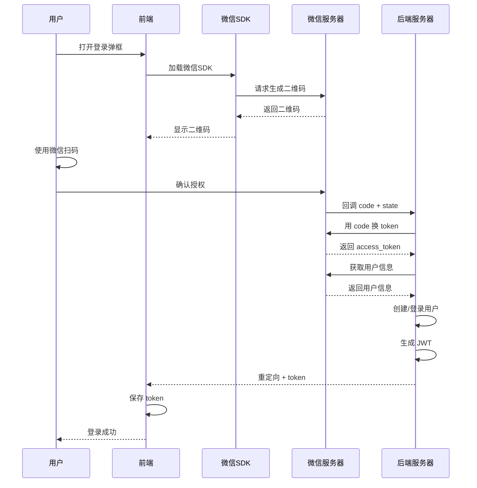

# 微信扫码登录集成指南

## 📋 功能说明

LoginModal 组件已集成微信扫码登录功能，支持：
- ✅ 自动加载微信 JS SDK
- ✅ 动态生成微信登录二维码
- ✅ 支持微信扫码登录和手机号登录切换
- ✅ 配置化管理（AppID、回调地址等）

## 🚀 使用步骤

### 1. 申请微信开放平台应用

访问 [微信开放平台](https://open.weixin.qq.com/)：

1. 注册/登录微信开放平台
2. 创建网站应用
3. 填写应用信息（名称、简介、图标等）
4. 配置授权回调域（如：`qtoplay.com`）
5. 获取 **AppID** 和 **AppSecret**

### 2. 配置 AppID

编辑 `/src/config/wechatConfig.ts`：

```typescript
export const WECHAT_CONFIG = {
  // 替换为你的微信开放平台应用AppID
  appid: 'wx1234567890abcdef',  // ⬅️ 修改这里
  
  scope: 'snsapi_login',
  
  getRedirectUri: () => {
    const origin = window.location.origin;
    return `${origin}/api/auth/wechat/callback`;  // ⬅️ 确认回调地址
  },
  
  style: 'black',
  selfRedirect: false,
};
```

或使用环境变量（推荐）：

```bash
# .env.local
REACT_APP_WECHAT_APPID=wx1234567890abcdef
```

### 3. 后端实现回调接口

创建后端接口 `/api/auth/wechat/callback` 处理微信回调：

```python
# Python Flask 示例
@app.route('/api/auth/wechat/callback')
def wechat_callback():
    code = request.args.get('code')
    state = request.args.get('state')
    
    if not code:
        return jsonify({'error': '授权失败'}), 400
    
    # 1. 使用 code 换取 access_token
    token_url = f'https://api.weixin.qq.com/sns/oauth2/access_token'
    params = {
        'appid': WECHAT_APPID,
        'secret': WECHAT_SECRET,
        'code': code,
        'grant_type': 'authorization_code'
    }
    response = requests.get(token_url, params=params).json()
    
    access_token = response.get('access_token')
    openid = response.get('openid')
    
    # 2. 获取用户信息
    user_info_url = f'https://api.weixin.qq.com/sns/userinfo'
    user_params = {
        'access_token': access_token,
        'openid': openid
    }
    user_info = requests.get(user_info_url, params=user_params).json()
    
    # 3. 创建/登录用户
    user = create_or_login_user(openid, user_info)
    
    # 4. 生成 JWT token
    token = generate_jwt_token(user)
    
    # 5. 重定向到前端，携带token
    return redirect(f'https://qtoplay.com/?token={token}')
```

### 4. 前端处理登录回调

在 `app.tsx` 或入口组件处理 token：

```typescript
// src/app.tsx
import { useEffect } from 'react';
import { history } from '@umijs/max';

export function rootContainer(container: JSX.Element) {
  // 处理微信登录回调
  useEffect(() => {
    const urlParams = new URLSearchParams(window.location.search);
    const token = urlParams.get('token');
    
    if (token) {
      // 保存 token
      localStorage.setItem('token', token);
      
      // 清除 URL 参数
      history.replace(window.location.pathname);
      
      // 刷新页面或跳转
      window.location.reload();
    }
  }, []);

  return container;
}
```

## 📝 配置文件说明

### wechatConfig.ts

| 配置项 | 说明 | 示例 |
|--------|------|------|
| `appid` | 微信开放平台应用ID | `wx1234567890abcdef` |
| `scope` | 授权作用域 | `snsapi_login` |
| `getRedirectUri()` | 回调地址 | `https://qtoplay.com/api/auth/wechat/callback` |
| `style` | 二维码样式 | `black` 或 `white` |
| `selfRedirect` | 是否当前页跳转 | `false`（推荐） |

## 🎨 样式自定义

### 修改二维码尺寸

编辑 `/src/components/LoginModal/index.less`：

```less
.wechat-qrcode-wrapper {
  iframe {
    width: 300px !important;   // ⬅️ 修改宽度
    height: 400px !important;  // ⬅️ 修改高度
  }
}
```

### 自定义二维码样式

使用 `href` 参数加载自定义CSS：

```typescript
wxLoginInstanceRef.current = new window.WxLogin({
  // ...其他配置
  href: 'https://yourdomain.com/wechat-qr-custom.css',
});
```

## 🔐 安全注意事项

### 1. 回调域名白名单

在微信开放平台配置授权回调域：
- 开发环境：`localhost:8000`
- 生产环境：`qtoplay.com`

### 2. State 参数验证

后端接收到 callback 时应验证 state 参数：

```python
# 保存 state（Redis）
redis.setex(f'wechat_state:{state}', 300, '1')

# 验证 state
if not redis.get(f'wechat_state:{state}'):
    return jsonify({'error': 'Invalid state'}), 400
```

### 3. Token 安全

- 使用 HTTPS
- Token 设置过期时间
- 敏感操作需要二次验证

## 🐛 常见问题

### 1. 二维码不显示

**原因**：AppID 未配置或错误

**解决**：检查 `wechatConfig.ts` 中的 appid 配置

### 2. 扫码后跳转失败

**原因**：回调地址未在微信开放平台配置

**解决**：在微信开放平台添加回调域名到白名单

### 3. 开发环境无法使用

**原因**：微信开放平台不支持 `localhost` 回调

**解决**：
- 使用内网穿透工具（如 ngrok）
- 配置本地域名映射

### 4. 二维码过期

**原因**：微信二维码有效期为 2 分钟

**解决**：自动刷新或提供刷新按钮

## 📚 相关文档

- [微信开放平台文档](https://developers.weixin.qq.com/doc/oplatform/Website_App/WeChat_Login/Wechat_Login.html)
- [微信登录接入指南](https://developers.weixin.qq.com/doc/oplatform/Website_App/WeChat_Login/Wechat_Login.html)
- [OAuth 2.0 协议](https://oauth.net/2/)

## 🎯 完整流程


